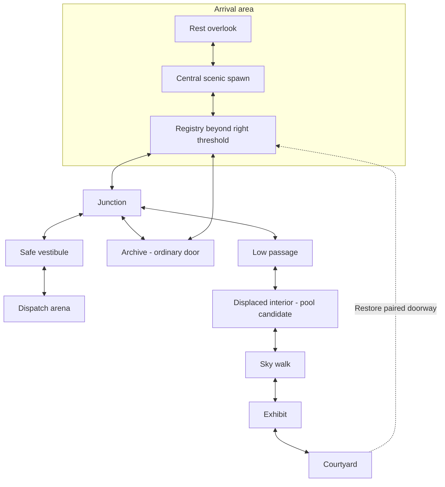

# Recommended floor plan — central scenic arrival

Planning/design evaluation,2026-09-13. Not implemented or playtested. This recommendation responds to Dex's latest instruction: the first composition is central, scenic and free of service content; clouds and huge distant structures establish awe, with a subtle invitation right and a meaningful resting branch left. The lower website remains deferred.

## Recommendation

A two-sided scenic arrival feeds a compact service junction and a larger exploration loop. Keep the player near the centre of the FIRST CAMERA VIEW, not necessarily the geometric centre of the entire map. This preserves a clear main route without making the initial composition feel like the start of a one-way service corridor.

The new [central arrival study](map-exploration/arrival-central-v2.png) removes the desk/NPC/donation/bench/banner from the first frame. The earlier [arrival study](map-exploration/arrival-stillness-v1.png) remains the visual reference but its centred service grouping is superseded. The new image is a still composition; the cloud layers have not been extracted or animated.

## Evaluation of the alternatives

| Plan | Strength | Relevant weakness |
|---|---|---|
| Open Atrium sheet | Clear geographic relationships and strong monumental material language | Serial arrival -> services -> arena; repeated floors and visible rooms make the first impression content-heavy |
| Courtyard Between sheet | Strong room variety, human familiarity and useful door/return structure | The initial strip still channels right; vertical circulation crowds registry; impossible links can become confusing if their endpoints are not recognisable |
| Suspended Interchange sheet | Scale and exposed atmosphere | Darker than the preferred aesthetic, still a long main strip; not the selected visual direction |
| Central arrival + two loops | Scenery owns the opening; both directions offer something; arena remains easy to find; gallery exploration returns meaningfully | Must deliberately frame the first view and hide service alcoves, especially on ultrawide; final movement distances need playtesting after go |

These are design judgments from inspected concepts, not measured user-study scores.

## Intended topology

This is a connection diagram, not a literal projection of all floors. The arrival's first-camera rectangle contains only VISTA. REST and REG occupy adjacent reveals outside that rectangle. The upper scenic route initially turns back left/across the map from Junction and then rises; it must not be another uninterrupted extension to the right. Archive is below the junction/registry side. Arena is a short deliberate branch to the right. Doors may bridge impossible distances but use recognisable paired frames and stable destination relationships.

### Arrival and first camera

- Centre the traveller at approximately50% horizontal position, feet around80-83% of the picture. These are starting composition coordinates, not fixed runtime requirements.
- Keep a clear, safe floor in both directions. A colossal structure partly outside the frame and partly occluded by clouds supplies scale; ordinary ground edges anchor the viewer.
- No accountant, account table, donation plaque, product/menu labels, enemies, story text or interaction prompts in the first gameplay composition. Minimal intro/essential controls can be designed separately; no content panel should appear automatically.
- Right guidance: one narrow muted-red floor inlay/maintenance line. It begins slightly to the right of the traveller and continues behind the next architectural support. Its visual prominence stays below the landscape and character. Do not add a second arrow, quest marker or constantly moving breadcrumb effect by default.
- Left guidance: an equally traversable floor with a shaded neighbouring recess. Discover a bench and altered view of the distant form there. The landing's far end visibly terminates at a rail/wall. No invisible wall suggesting an unfinished main route.
- The person remains legible. Enlarge the architecture and perceived distance rather than shrinking all human-scale objects to map symbols.

### Rest branch

Proposed initial travel target: roughly3-5 seconds of ordinary movement from spawn, excluding any time looking around. A view, bench and optional rest/sit state are enough payoff. Do not add a compulsory collectible, hidden upgrade, donation panel or story requirement merely to justify this branch. The short return is intentional.

### Registry and junction

Proposed initial travel target: about6-10 seconds from spawn at ordinary movement, with the registry revealed gradually after choosing right. It remains near the start but outside the first shot, screened by a pier/recess rather than hidden in a menu or distant room. Walking to it requires no jump, gate, combat or sign-in. The player may pass the desk without interacting.

Put the first donation/top-donor point beside the registry. The failed Courtyard door and story clue sit in this revealed area, not inside the spawn composition. The junction comes just beyond it, with a clear safe main continuation toward Dispatch and optional archive/scenic exits.

### Main arena branch

Short approach from junction -> safe vestibule -> deliberate encounter entry. The fight never starts from wandering through the junction, returning from another room or closing a reader. Mobs cannot follow into arrival/registry/resting areas. Keep archive exit and arena entry physically separate.

Each new in-world collection uses a fresh constructed warden. Defeat -> black transition -> product menu -> explicit file action. On leaving the menu, return to a safe vestibule. Boss/progression remain personal.

### Archive loop

An ordinary door and short descent reach the archive. A separate exit returns to the registry-side landing. This yields another understandable connection without making documentation a story prerequisite. Do not require using the courtyard return or defeating the arena boss to open it.

### Scenic exhibit and courtyard loop

After junction, turn back across the map through a low passage, then a distinctive displaced interior (pool remains a candidate), an exposed sky walk, exhibit, and courtyard. This supplies compression -> expansion -> quiet occupied space. Use repeated views of the same landmark and courtyard identifier to support recognition.

Opening the courtyard's far-side maintenance latch restores the paired door near REGISTRY. It must not deliver traffic into the central spawn picture or the arena. This single useful return is the story payoff; do not also add an immediate exhibit-to-arrival elevator that makes the restored door redundant. The accountant's small response belongs in the registry/courtyard threshold area.

## Atmosphere and pacing

The visitor controls when to start moving. There is no compulsory timer to admire the scene. For someone who immediately walks right, the level supplies several seconds of scenery before an optional service interaction. A visitor who stays put can watch as long as desired.

At rest, the camera, architecture and main light stay still. Let cloud layers move relative to one another and gradually occlude distant structural details. Far clouds move slowest; nearer cloud/veil layers move slightly faster. A provisional desktop tuning experiment could use around0.2-0.5 CSS pixels/second for far drift and1-2 for the nearer layer at a1440-pixel-wide view; these are test values, not claims about existing animation or mandatory ratios. Avoid all clouds moving synchronously or the huge buildings bobbing.

Proposed camera test: central dead zone roughly12-15% of screen width to each side, so small steps do not immediately move the view. After committed movement, ease into follow and modest direction look-ahead. Do not pan or zoom automatically to create an intro. Reduced motion uses static decorative layers. Mobile/iPad need composed first-camera variants; ultrawide must not reveal the hidden registry simply by showing more of the level.

## Evidence behind the judgment

- [Journey creator introduction](https://blog.playstation.com/2010/06/17/introducing-thatgamecompanys-journey/): awe, small traveller and a visible distant destination motivate exploration before explanation. Our central-spawn/trail implementation is a proposal, not a measured Journey technique.
- [Team Cherry creator interview](https://www.pcgamer.com/how-to-design-a-great-metroidvania-map/): connected areas, recognisable spatial relationships and discoveries as sights/people/events. It also describes iterative room-spacing tests rather than a universal mathematical optimum. We adapt that coherence to a compact browser experience, with clearly signalled impossible doors.
- Current reference images were visually inspected. No playable map, cloud motion, native input or device test occurred during this planning evaluation.

## Next acceptance

Review the central scenic composition and the proposed routes with Dex. Then draw the entire arrival area's actual first-camera rectangle, both side reveals and the registry alcove at compatible scale. Only after that should later room compositions be generated. Implementation and production layer extraction still require go.

## Generation provenance

Built-in image_gen edited arrival-stillness-v1.png as the reference. The result was copied unchanged and copy hashes matched. Exact prompt follows.

Revise the attached arrival concept into the actual FIRST CAMERA VIEW of this 2D side-scrolling pixel-art world. Preserve the beautiful vast pale-concrete opening, lavender/peach/blue light, immense suspended ring structure, coherent visible square pixel clusters and the small anime-adjacent katana traveller. Target wide 16:9 around2560x1440. Whole-room composition, no map or diagram.

CRITICAL CHANGE: the user wants SCENERY FIRST, with a central spawn and freedom to move left or right. REMOVE the entire account registry table, accountant, lamp on the table, donation box, donor plaque, bench, wall banner, and all service/content objects from this image. Those exist in neighbouring alcoves outside the first camera view. Do not put any new content, furniture, NPC, door prompt or service where the desk used to be. Leave that space quiet.

Place the ONE small traveller exactly at horizontal50% of the image, feet around81% down the frame. Visible body height about5% of image height. Sword sheathed, calm neutral idle. There is ample continuous SAFE dry walkable floor extending equally to LEFT and RIGHT, not a cliff edge spawn and not a room exit. No obstacle/hazard/tutorial near the traveller. The flat side-view playable surface sits in the bottom fifth, with subtle non-receding tile texture and one clear horizontal foot-contact line.

The eye should first take in a vast quiet opening and colossal distant form, then discover the tiny central person. Central person DOES NOT mean perfectly symmetric scenery. Architectural supports are cropped at extreme left and right edges, providing two plausible walkable continuations. The enormous room continues beyond both. Central negative space remains broad and uninterrupted; no added decorative grid, balcony maze or lamps across the middle.
The existing huge pale suspended ring remains partly beyond the upper/right frame, but deepen its overwhelming scale by hiding part of its underside behind a broad middle-distance cloud bank. Tiny structural marks should convey immense size, not become texture noise. Quiet far sky occupies a large connected region. Show clearly separable FAR sky/cloud bank, MID cloud band partially occluding the structure, and a very faint NEAR atmospheric veil below the distant horizon; these are intended to drift at different slow speeds later. This is a still concept image, not an animation. The giant structure itself appears stationary.
Give the user ONE subtle environmental direction cue: a THIN interrupted muted-vermilion maintenance inlay on the floor starts a little RIGHT of the traveller and continues to the right edge around the far support. It is worn paint/tile inlay, low-contrast, very narrow. No arrows, glowing magic breadcrumbs, animated particles or big directional lights. The left path remains clearly open and equally safe, with gentle shaded light at its edge suggesting a quiet neighbouring overlook without showing a bench here.
The first frame contains ONLY the tiny traveller, vast architecture, layered atmospheric scenery and that subtle floor mark. No readable words at all, no title/logo/tagline/labels/legend/UI, no service icons, no other people or enemies. Do not add objects to fill emptiness. This is cinematic stillness and megalophobic scale in an inviting otherworldly pixel-art environment. Preserve the established aesthetic and do not switch to horror, medieval ruins, photorealism or 3D render.
